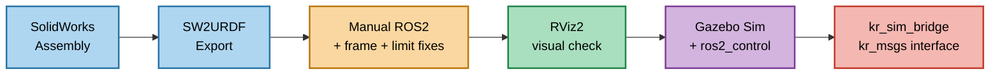
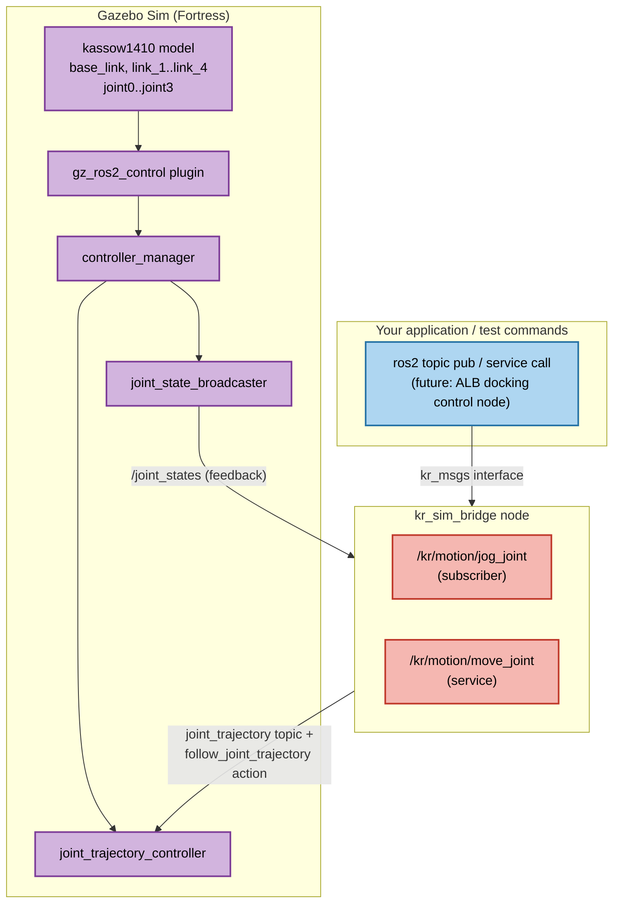

# Kassow KR1410 Simulation Pipeline — ME5400A

This documents how the Kassow KR1410 went from a SolidWorks assembly to a
Gazebo simulation that responds to the same ROS2 interface (`kr_msgs`) as
the real robot. Written as a companion to the AprilTag perception
documentation from the earlier project phase.

---

## 1. Goal

Get a working simulated stand-in for the real KR1410 so that ROS2 code
written against Kassow's real robot interface (`orange-ros2` / `kr_msgs`)
can be developed and tested without hardware access — and will transfer
to the real arm with minimal changes later.

---

## 2. Pipeline overview



Each stage is described below in the order it was actually done.

### 2.1 SolidWorks → SW2URDF export

- The KR1410 was modeled/assembled in SolidWorks and exported using the
  **SW2URDF** plugin, producing a package named `Kassow1410_ROS2_URDF`.
- SW2URDF is a ROS1/catkin-era tool. Its output is **not** ROS2-compatible
  out of the box:
  - `package.xml` and `CMakeLists.txt` are catkin-style.
  - Launch files are ROS1 XML format (`gazebo.launch`), not Python.
  - Joint `<limit>` values are frequently exported as all-zero
    placeholders, not real kinematic limits.

### 2.2 Making the package ROS2-compatible

- Renamed the package to lowercase `kassow1410_ros2_urdf` (ROS2/REP 144
  requires lowercase, alphanumeric + underscore package names).
- Rewrote `package.xml` (format 3, `ament_cmake` build type) and
  `CMakeLists.txt` (installs `urdf`, `meshes`, `launch`, `rviz`, `config`
  directories).
- Wrote Python launch files (`display.launch.py` for RViz,
  `gz.launch.py` for Gazebo) to replace the ROS1 XML launch files.

### 2.3 Getting it upright and moving in RViz

Two real bugs were found and fixed here:

1. **Orientation.** The exported model appeared on its side in RViz. The
   mesh geometry itself wasn't tilted — the issue was that SolidWorks'
   assembly axes didn't match ROS's "Z-up" convention. Fixed by adding a
   virtual `world` link with a fixed joint into `base_link` carrying a
   corrective rotation, found empirically:
   ```xml
   <link name="world"/>
   <joint name="world_to_base_link" type="fixed">
     <parent link="world"/>
     <child link="base_link"/>
     <origin xyz="0 0 0" rpy="-1.5708 0 0"/>
   </joint>
   ```
   Rotating once at the root carries the whole downstream tree with it,
   since every other joint's origin is defined relative to its parent.

2. **Zero joint limits.** All four joints (`joint0`–`joint3`) exported
   with `lower="0" upper="0" effort="0" velocity="0"`. This is why
   `joint_state_publisher_gui` showed no sliders — a zero-width range has
   nothing to expose. Fixed by setting real placeholder limits:
   ```xml
   <limit lower="-3.14159" upper="3.14159" effort="100" velocity="2.0"/>
   ```
   ⚠️ **These are placeholders**, not real KR1410 datasheet values — see
   §6.

RViz was set to Fixed Frame `world`, RobotModel display pointed at
`/robot_description`, and the arm rendered correctly and moved with the
joint sliders.

### 2.4 Bringing it into Gazebo (physics, no control yet)

- Installed `ros_gz` (Gazebo Fortress bridge for Humble).
- `gz.launch.py` starts `gz sim`, publishes `robot_description` via
  `robot_state_publisher`, and spawns the entity with `ros_gz_sim`'s
  `create` node, subscribed directly to the `robot_description` topic
  (no manual URDF→SDF conversion needed).
- **Mesh resolution bug:** Gazebo Sim doesn't use ROS's package index.
  `ros_gz_sim` rewrites `package://` mesh URIs to `model://` on spawn,
  and Gazebo has no way to resolve `model://kassow1410_ros2_urdf/...`
  unless told where to look. Fixed by setting `GZ_SIM_RESOURCE_PATH` to
  the parent of the package's installed `share/` directory, done
  automatically inside `gz.launch.py` via `SetEnvironmentVariable` so it
  doesn't need to be exported by hand each run.

### 2.5 Adding `ros2_control` (making it actuatable in sim)

- Installed `ros-humble-gz-ros2-control` (the current Humble/Fortress
  package name — it was called `ign_ros2_control` in older docs).
- Added a `<ros2_control>` block to the URDF declaring
  `gz_ros2_control/GazeboSimSystem` hardware, with `position` command
  interfaces and `position`/`velocity` state interfaces for each of the
  4 active joints.
- Added a `<gazebo><plugin>` block pointing at a controller config YAML
  (`kassow1410_controllers.yaml`) defining a `joint_state_broadcaster`
  and a `joint_trajectory_controller`.
- **Path substitution issue:** plain URDF (not xacro) doesn't understand
  `$(find pkg)`-style substitution. Worked around by putting a plain
  text placeholder (`GZ_ROS2_CONTROL_CONFIG_PATH`) in the URDF's
  `<parameters>` tag, and having `gz.launch.py` read the URDF as a
  string and substitute in the real installed absolute path before
  publishing it as the `robot_description` parameter.
- Also bridged Gazebo's simulated clock to ROS2
  (`/clock` via `ros_gz_bridge`'s `parameter_bridge`) — required for
  `controller_manager` to advance sim time correctly.
- Controller spawners (`joint_state_broadcaster`, then
  `joint_trajectory_controller`) are started via `TimerAction` delays in
  the launch file, giving the `gz_ros2_control` plugin time to bring up
  its internal `controller_manager` after the entity spawns.

**Result, verified working:** arm renders correctly in Gazebo with
correct collision geometry, and moves smoothly in response to
`JointTrajectory`/`FollowJointTrajectory` commands sent through
`joint_trajectory_controller`.

### 2.6 Bridging to the real robot's ROS2 interface (`kr_msgs`)

Kassow ships `orange-ros2`, a ROS2 package exposing the **real robot
controller's** interface (`kr_msgs` messages/services like
`/kr/motion/jog_joint` and `/kr/motion/move_joint`) — but it only works
when talking to an actual Kassow controller ("CBun") over the network.
There's no Gazebo plugin in it at all.

So a new package, **`kr_sim_bridge`**, was written to expose the *same*
`kr_msgs` interface but internally drive the simulated
`joint_trajectory_controller` instead of a real controller:

- **`/kr/motion/jog_joint`** (`kr_msgs/msg/JogJoint`, a topic): receives
  streamed joint velocities in **deg/s**. The bridge converts to rad/s,
  integrates position at 20 Hz, clamps to joint limits, and republishes
  as small `JointTrajectory` steps. Includes a 0.5 s safety timeout —
  jogging stops automatically if no fresh command arrives.
- **`/kr/motion/move_joint`** (`kr_msgs/srv/MoveJoint`, a service):
  receives an absolute 7-element joint configuration in **degrees**
  plus timing fields (`ttype`/`tvalue`). The bridge converts to radians,
  computes a move duration (directly from `tvalue` if `ttype==TT_TIME`,
  or derived from commanded deg/s if `ttype==TT_VEL`), and sends a
  `FollowJointTrajectory` action goal to the simulated controller,
  returning `success` once the goal completes.
- **7→4 joint mapping:** the real KR1410 is a 7-axis arm; the current
  URDF only actuates 4 joints (the rest are fixed in the CAD for now).
  Empirically, the real robot's 7-element arrays use indices 1–4 for the
  four joints currently modeled — index 0, 5, 6 are ignored.

**Result, verified working end-to-end:**
```bash
ros2 topic pub -r 20 /kr/motion/jog_joint kr_msgs/msg/JogJoint "jsvel: [0.0, 15.0, 0.0, 0.0, 0.0, 0.0, 0.0]"
# → joint0 rotates continuously in Gazebo

ros2 service call /kr/motion/move_joint kr_msgs/srv/MoveJoint \
  "{jsconf: [0.0, 20.0, -15.0, 30.0, 10.0, 0.0, 0.0], ttype: 1, tvalue: 3.0, ...}"
# → arm moves smoothly to the target configuration, response: success=true
```

---

## 3. Current running system (architecture)



RViz2 sits alongside this independently (`display.launch.py`), driven
directly by `robot_state_publisher` + `joint_state_publisher_gui`, for
visual/kinematic checks without needing Gazebo running.

---

## 4. Package layout

```
alb_ws/src/
├── kassow1410_ros2_urdf/
│   ├── urdf/kassow1410.urdf          # world link, 4 joints, ros2_control block
│   ├── meshes/*.STL
│   ├── config/kassow1410_controllers.yaml
│   ├── launch/
│   │   ├── display.launch.py         # RViz only
│   │   └── gz.launch.py              # Gazebo + ros2_control + clock bridge
│   └── rviz/                         # display.rviz (save once satisfied)
│
├── orange-ros2/                      # Kassow's real-robot ROS2 interface
│   ├── kr_msgs/                      # message/service definitions (builds fine on Humble)
│   └── kr_example_cpp/               # demo nodes — do NOT build (see §6)
│
└── kr_sim_bridge/                    # new: kr_msgs ⇄ simulated controller
    └── kr_sim_bridge/kr_sim_bridge_node.py
```

---

## 5. Startup commands (quick reference)

### One-time / after pulling changes
```bash
cd ~/alb_ws
colcon build --packages-skip kr_example_cpp
source install/setup.bash
```

### Workflow A — RViz only (quick visual/kinematic check, no physics)
```bash
# Terminal 1
source ~/alb_ws/install/setup.bash
ros2 launch kassow1410_ros2_urdf display.launch.py
```

### Workflow B — Full Gazebo + control + kr_msgs bridge

```bash
# Terminal 1 — Gazebo, ros2_control, controllers
source ~/alb_ws/install/setup.bash
ros2 launch kassow1410_ros2_urdf gz.launch.py
```
```bash
# Terminal 2 — the kr_msgs bridge (start after Terminal 1's spawners finish)
source ~/alb_ws/install/setup.bash
ros2 run kr_sim_bridge kr_sim_bridge_node
```
```bash
# Terminal 3 — send test commands
source ~/alb_ws/install/setup.bash

# Jog joint0 continuously (Ctrl+C to stop)
ros2 topic pub -r 20 /kr/motion/jog_joint kr_msgs/msg/JogJoint \
  "jsvel: [0.0, 15.0, 0.0, 0.0, 0.0, 0.0, 0.0]"

# Move to an absolute joint configuration over 3 seconds
ros2 service call /kr/motion/move_joint kr_msgs/srv/MoveJoint \
  "{jsconf: [0.0, 20.0, -15.0, 30.0, 10.0, 0.0, 0.0], ttype: 1, tvalue: 3.0, bpoint: 0, btype: 1, bvalue: 2.0, sync: 0.0, chaining: 1}"
```

### Useful diagnostics
```bash
ros2 control list_controllers          # confirm both controllers are 'active'
ros2 topic echo /joint_states --once   # confirm real-time joint feedback
ros2 run tf2_tools view_frames         # sanity-check the TF tree
```

---

## 6. Assumptions and things that still need refinement

These are the gaps between "the simulation works" and "this will behave
like the real robot." Listed roughly in priority order for closing the
sim-to-real gap.

1. **Joint limits are placeholders, not datasheet values.**
   `lower="-3.14159" upper="3.14159" effort="100" velocity="2.0"` for
   all four joints — chosen only to unblock testing. Need to pull actual
   per-axis limits from the KR1410 datasheet and set them individually
   (they will differ per joint on the real arm).

2. **Only 4 of 7 axes are modeled.** The other 3 are fixed in the
   SolidWorks assembly/CAD. Freeing them (re-exporting or manually
   editing the URDF) is required before this can represent the full
   arm, and will change the `kr_msgs` index mapping in item 3 below.

3. **The 7→4 index mapping (jsvel/jsconf indices 1–4 → joint0–joint3) is
   empirical, not confirmed against Kassow documentation.** It was
   inferred, not verified against an authoritative source (e.g. Kassow's
   own joint-numbering convention in their manuals). Worth confirming
   before trusting it against the real robot, and will need to be
   extended once all 7 joints are modeled.

4. **`MoveJoint`'s blend/chaining fields are ignored.** `bpoint`,
   `btype`, `bvalue`, `chaining`, and `sync` exist on the real interface
   to let multiple queued motions blend smoothly into one another. The
   bridge currently executes each `move_joint` call as an independent,
   fully-stopping point-to-point motion — it will not replicate the real
   robot's blended-motion behavior. Needed if the ALB docking sequence
   relies on smooth multi-point moves.

5. **No effort/torque limiting matches real actuator specs.** The
   simulated joints will accept commands the real motors might reject or
   behave differently under (e.g. near payload limits). Not modeled.

6. **Controller update rate vs. sim step size mismatch warning** appears
   in the logs (`Desired controller update period (0.01s) is slower than
   the gazebo simulation period (0.001s)`) — not tuned, currently
   harmless but worth revisiting if trajectory tracking accuracy becomes
   important later (e.g. for precise ALB hook alignment).

7. **The `world_to_base_link` rotation (`rpy="-1.5708 0 0"`) was found
   empirically** by trial and error until the model looked upright in
   RViz — it has not been verified against the real robot's actual
   mounting/base orientation convention.

8. **`kr_example_cpp` doesn't build on Humble** (uses the Dashing/Foxy-era
   `rclcpp::executor::FutureReturnCode` path, since renamed to
   `rclcpp::FutureReturnCode`). Currently excluded from builds via
   `colcon build --packages-skip kr_example_cpp`. Not required for
   anything working today, but if Kassow's real demo code is ever
   needed as reference, it needs this one-line fix per file.

9. **This is a pure simulation substitute — no hardware-in-the-loop
   validation yet.** Nothing here has been tested against an actual
   Kassow CBun or real robot. The `kr_msgs` field-level contract
   (units, index order, service semantics) should be re-verified against
   real hardware or Kassow's official documentation before relying on it
   for anything safety-relevant.

10. **No RViz config (`display.rviz`) has been confirmed saved** — worth
    doing once the visual setup is finalized, so `display.launch.py`
    doesn't open with default (unconfigured) RViz settings each time.

---

## 7. Suggested next steps

- Pull real KR1410 joint limits and update the URDF (item 1)
- Free the remaining 3 joints in CAD/URDF for a full 7-axis model (item 2)
- Verify the index mapping in item 3 against Kassow's own documentation
- Decide whether blend/chaining support is needed for ALB docking motions (item 4)
- Begin integrating this simulated arm with the AprilTag docking/perception work
