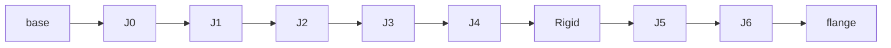
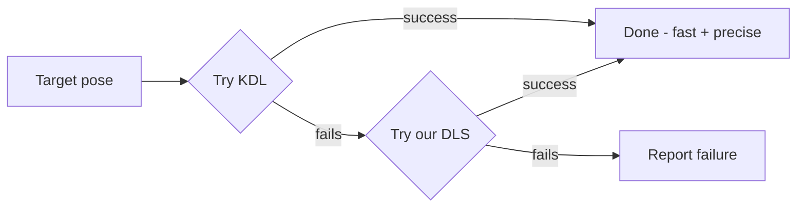

# KR1410 Kinematics — Quick Reference

## 1. Forward Kinematics = Chain of Transforms



For each joint:

```
T_joint = T_origin · Rotation(axis, θ)
T_flange = T_base · T_J0 · T_J1 · ... · T_J6
```

- `T_origin` = fixed URDF offset
- `axis` = joint's own rotation axis (not always Z — ours are arbitrary CAD vectors)
- Multiply all 8 in sequence → end-effector pose

**No shortcuts here** — just correct bookkeeping.

---

## 2. The Jacobian — "which way does the tool move?"

6×7 matrix. Column *i* = joint *i*'s effect on end-effector velocity.

| Part | Formula | Meaning |
|---|---|---|
| Angular | `z_i` | joint's axis, in base frame, right now |
| Linear | `z_i × (p_end − p_i)` | ω × r (rigid body velocity) |

```
[ v ]   [ J_linear  ]
[ ω ] = [ J_angular ] · q̇
```

---

## 3. Two IK Solvers — Head to Head

| | **Ours (DLS)** | **KDL (NR_JL)** |
|---|---|---|
| Update rule | `Δq = Jᵀ(JJᵀ + λ²I)⁻¹ · error` | Newton-Raphson + joint limits |
| Source | hand-derived | parses URDF directly |
| Speed | baseline | **50–150× faster** |
| Precision | baseline | **100–1000× tighter** |
| Reliability | ✅ succeeded on a case KDL failed | ❌ failed once in testing |

**Why damping?** Plain pseudoinverse blows up at singularities (asks for ∞ joint speed for a small move). `λ²I` trades a little accuracy for guaranteed stability.

**Design decision:**


---

## 4. Joint-Space vs Cartesian-Space Interpolation

**The bug we found:** interpolating *joint angles* linearly ≠ straight line in space.

```
Joint-space (WRONG for move_linear):     Cartesian-space (correct):

   start                                    start
     \                                        \
      \___                                     \
          \___  <- curves!                      \___
              \___                                   \___
                  target                                  target
  (each joint moves at constant                (position: lerp
   rate -> nonlinear result in                  orientation: slerp
   Cartesian space)                             -> solve IK per waypoint)
```

| | Joint-space | Cartesian-space |
|---|---|---|
| Interpolates | joint angles | pose (pos + orientation) |
| Path shape | curved, unpredictable | straight line (as commanded) |
| IK calls | once (endpoint) | once per waypoint |
| Use for | `move_joint` | `move_linear` |

**Fix implemented:**
1. Sample N waypoints (~1cm / ~3° spacing) along the line
2. Position: `lerp(start, end, alpha)` — **linear interpolation**: `a + alpha·(b−a)`, straight line, constant speed
3. Orientation: `slerp(start, end, alpha)` — **spherical linear interpolation**: quaternions can't be lerp'd directly (distorts/shrinks the rotation) — slerp walks the shortest arc on the rotation sphere at constant angular speed
4. Solve IK per waypoint — **seed each with the previous solution** (keeps redundant arm's configuration consistent)
5. All waypoints must succeed before any motion is sent

---

## Bugs Found & Fixed
- Joint index offset (wrong axis mapping) -> direct 1:1 mapping
- Trajectory controller reported success without checking tolerance -> added goal tolerances
- Result-wait timeout too tight -> increased margin
- `move_linear` traced curves, not lines -> Cartesian waypoint interpolation

---

## How We Got Here (Step by Step)

1. **CAD investigation** — discovered the real KR1410 is 7-DOF; our URDF only modeled 4 (3 axes fixed in CAD)
2. **Mate audit** — mapped all 7 real joints via SolidWorks mates; found the "missing" J3 hidden inside a multi-body part
3. **Extracted J3** — split it into its own component, mated properly
4. **Reoriented base** — CAD was sideways; fixed upright at the true origin
5. **Fixed mass properties** — parts had no material assigned; assigned real aluminum density, scaled to match the datasheet's 35kg total
6. **Re-exported URDF** — full 7-DOF, real per-joint limits (2 revolute + 5 continuous), added `world` link
7. **ROS2 package conversion** — catkin → ament, fixed mesh paths, launch files
8. **MoveIt config** — regenerated for 7-DOF, fixed missing controller config
9. **Smoke tests** — RViz + Gazebo, confirmed correct joint motion
10. **Extended `kr_sim_bridge`** — fixed wrong joint-index mapping, added real per-joint limit clamping
11. **Tested `move_joint`** — found & fixed the silent-success bug (tolerance check)
12. **Built FK by hand** — verified exactly against real TF
13. **Built the Jacobian** — verified via finite differences (found & fixed a bug in the *test*, not the code)
14. **Built our DLS IK solver** — verified via FK→IK round-trip
15. **Built KDL version + compared** — found the speed/precision vs. reliability tradeoff
16. **Wired combined IK service** — KDL primary, DLS fallback
17. **Implemented `move_linear`** — first pass used joint-space interpolation
18. **Found the curved-path bug** — visually, in RViz
19. **Fixed with Cartesian waypoint interpolation** — lerp + slerp, chained IK seeding


---

## Timeline: CAD Refinement → Working move_linear

1. **CAD mate audit** — found the real 7-DOF structure hiding in the SolidWorks assembly: one axis (J3) was fused inside a single-part "Bicep" body; another apparent joint (EDGE5-EDGE6) turned out to be a fake, permanently-rigid seam
2. **Extracted J3** as its own component, mated it properly; reoriented the whole assembly to stand upright
3. **Re-exported URDF** — pulled real datasheet limits (J2/J4 revolute, rest continuous), fixed mass properties to match the real 35kg robot weight
4. **Converted to ROS2** — catkin → ament package.xml/CMakeLists, renamed packages
5. **Smoke-tested** the 7-DOF model in RViz
6. **Built MoveIt config** — virtual joint, self-collision matrix, fixed a missing controller joint list
7. **Wired up Gazebo** — added `<ros2_control>` block, `world` link, controllers.yaml for all 7 joints
8. **Fixed kr_sim_bridge** — corrected a wrong joint-index mapping, verified `move_joint` across all 7 axes, fixed a false-success bug and a too-tight timeout
9. **Hand-rolled FK → Jacobian → DLS IK**, each verified independently before building the next layer
10. **Built KDL comparison** — found KDL is usually faster/more precise, but our solver succeeded once where KDL failed → combined strategy
11. **Exposed IK as a ROS2 service**, combining KDL (primary) + our DLS (fallback)
12. **Wired `move_linear`** to the service — first pass used joint-space interpolation (produced curved paths), fixed with proper Cartesian waypoint interpolation

---

## Commands: Bringing Each Piece Up

**🖥️ = needs its own terminal, left running** · **▶️ = one-off command, run once the 🖥️ terminals are up**

---

🖥️ **Smoke test (RViz only, no physics):**
```bash
ros2 launch kassow1410_ros2_urdf_7dof smoke_test.launch.py
```

🖥️ **MoveIt planning demo:**
```bash
ros2 launch kassow1410_7dof_moveit_config demo.launch.py
```

---

**For real motion testing, 3 terminals must be running at once:**

🖥️ **Terminal 1 — Gazebo (physics + controllers):**
```bash
ros2 launch kassow1410_ros2_urdf_7dof gz.launch.py
```

🖥️ **Terminal 2 — IK service (KDL + DLS fallback):**
```bash
ros2 run kassow1410_kinematics ik_service_node
```

🖥️ **Terminal 3 — kr_sim_bridge (jog_joint / move_joint / move_linear):**
```bash
ros2 run kr_sim_bridge kr_sim_bridge_node
```

▶️ **Terminal 4 — send motion commands here** (see below)

---

▶️ **Standalone verification programs** (no other terminals needed — run and exit on their own):
```bash
ros2 run kassow1410_kinematics jacobian_verification
ros2 run kassow1410_kinematics ik_verification
ros2 run kassow1410_kinematics kdl_comparison
```

---

## Motion Test Commands (Terminal 4)

**move_joint — push revolute joints, spin continuous joints:**
```bash
ros2 service call /kr/motion/move_joint kr_msgs/srv/MoveJoint \
  "{jsconf: [30.0, 0.0, 30.0, 0.0, 30.0, 30.0, 30.0], ttype: 1, tvalue: 5.0}"
```

**move_linear — Set 1: side to side**
```bash
ros2 service call /kr/motion/move_linear kr_msgs/srv/MoveLinear \
  "{pos: [500.0, 300.0, 600.0], rot: [0.0, 0.0, 0.0], ref: 1, ttype: 1, tvalue: 4.0}"
```
```bash
ros2 service call /kr/motion/move_linear kr_msgs/srv/MoveLinear \
  "{pos: [500.0, -300.0, 600.0], rot: [0.0, 0.0, 0.0], ref: 1, ttype: 1, tvalue: 4.0}"
```

**move_linear — Set 2: vertical / diagonal**
```bash
ros2 service call /kr/motion/move_linear kr_msgs/srv/MoveLinear \
  "{pos: [400.0, 0.0, 800.0], rot: [0.0, 0.0, 0.0], ref: 1, ttype: 1, tvalue: 4.0}"
```
```bash
ros2 service call /kr/motion/move_linear kr_msgs/srv/MoveLinear \
  "{pos: [700.0, 0.0, 400.0], rot: [0.0, 0.0, 0.0], ref: 1, ttype: 1, tvalue: 4.0}"
```

**move_linear — Set 3: in-place orientation flip**
```bash
ros2 service call /kr/motion/move_linear kr_msgs/srv/MoveLinear \
  "{pos: [500.0, 0.0, 600.0], rot: [0.0, 90.0, 0.0], ref: 1, ttype: 1, tvalue: 4.0}"
```
```bash
ros2 service call /kr/motion/move_linear kr_msgs/srv/MoveLinear \
  "{pos: [500.0, 0.0, 600.0], rot: [0.0, -90.0, 0.0], ref: 1, ttype: 1, tvalue: 4.0}"
```
